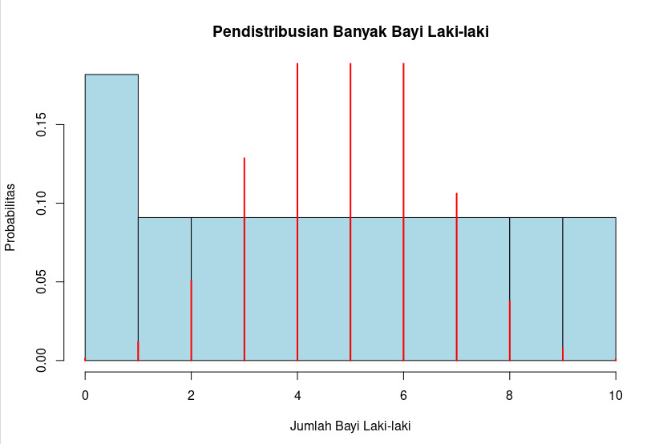
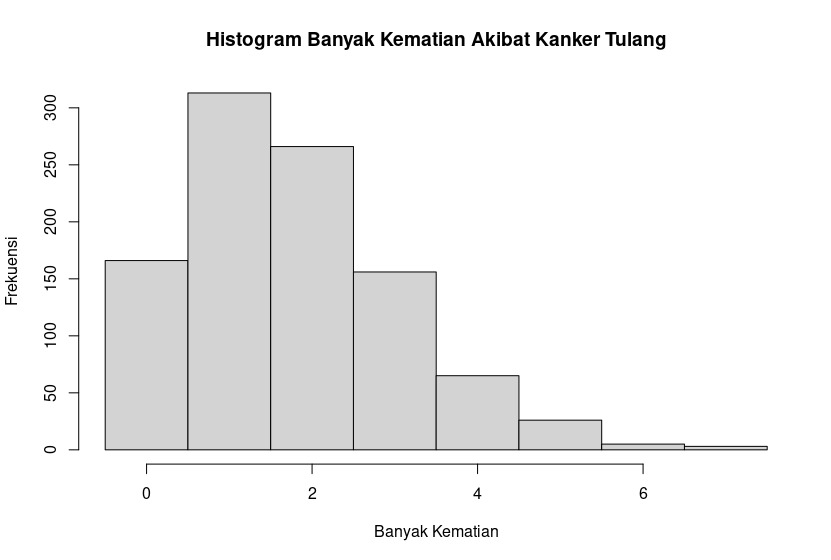
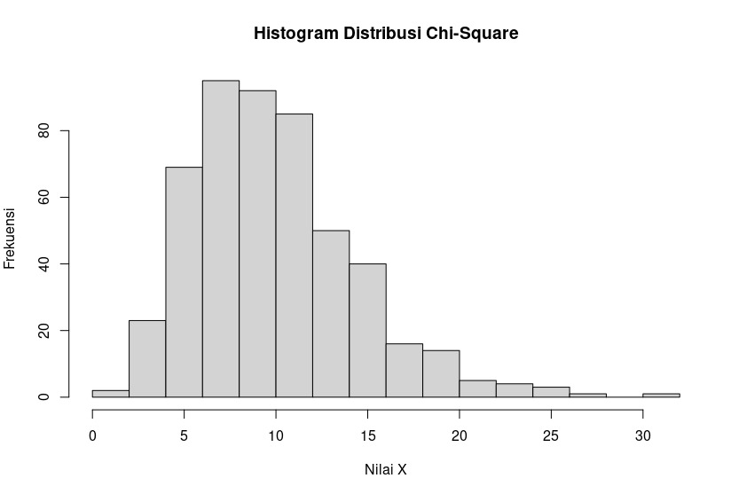
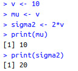
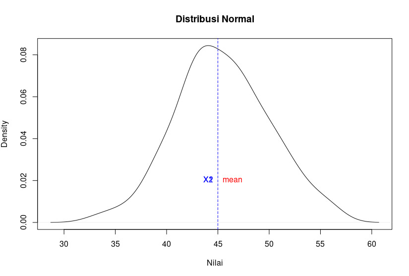
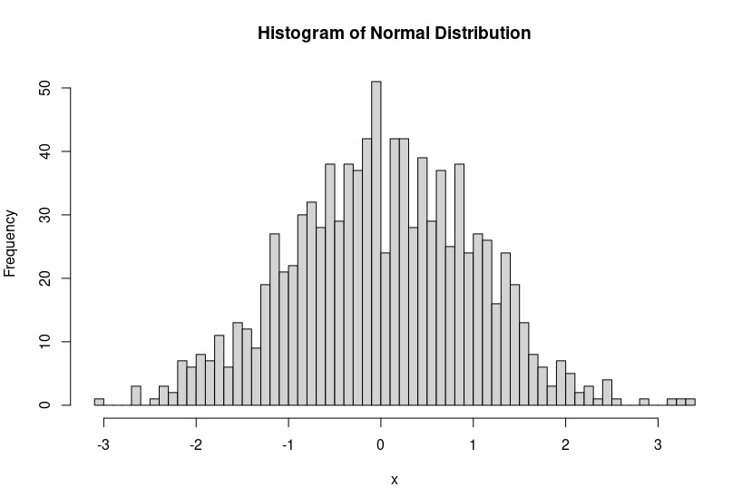
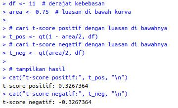
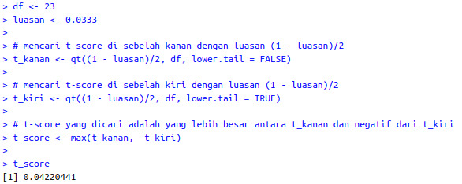

# Prak1_Probstat2023_C_5025211051

## 1. Distribusi Binomial
```
Probabilitas seorang bayi yang baru lahir berjenis kelamin laki-laki adalah 0,488. Jika kita asumsikan bahwa dalam satu hari di rumah sakit terdapat 10 kelahiran, maka ...
```

### a. Bagaimana pendistribusian banyak bayi laki-laki? Tentukan distribusi dengan parameter yang sesuai.
Pada soal di atas, dapat ditentukan bahwa parameter ```p = 0.488``` dan ```n = 10``` distribusi berjenis diskrit dan digunakan distribusi binomial.

### b. Berapa probabilitas bahwa tepat tiga bayi di antaranya berjenis kelamin laki-laki?
```x = 3``` dan digunakan rumus bawaan R ```dbinom()```.
```
p = 0.488
n = 10
dbinom(x, n, p)
```
Didapatkan hasil:


<br/>

### c. Berapa probabilitas bahwa kurang dari tiga bayi di antaranya berjenis kelamin laki-laki?
Untuk mendapatkan probabilitas untuk x < 3, dapat dilakukan perhitungan distribusi binomial untuk x = {0, 1, 2} kemudian dijumlahkan
```
p = 0.488
n = 10
dbinom(0, n, p) + dbinom(1, n, p) + dbinom(2, n, p)
```
Didapatkan hasil :


<br/>

### d. Berapa probabilitas bahwa tiga atau lebih bayi di antaranya berjenis kelamin laki-laki?
Untuk menghitung probabilitas tersebut, dapat dihitung probabilitas kumulatif untuk x = 2, kemudian 1 dikurangkan dengan hasilnya.
```
p = 0.488
n = 10
1 - pbinom(2, n, p)
```
Didapatkan hasil:


<br/>

### e. Berapa nilai harapan dan simpangan baku banyak bayi laki-laki?
Nilai harapan dapat dihitung menggunakan ```n * p``` dan standar deviasi dapat dihitung dengan ```sqrt(n * p * (1 - p))```

```
p = 0.488
n = 10
print(p*n)
print(sqrt(n*p*(1-p)))
```

Didapatkan hasil:


### f. Gambarkan histogram pendistribusian banyak bayi laki-laki.
Untuk menggambarkan histogram distribusi dapat digunakan rumus sebagai berikut
```
n = 10
p = 0.488
x = 0:n
prob = dbinom(x, n, p)
hist(x, breaks = n+1, col="lightblue", freq=FALSE, 
     main="Pendistribusian Banyak Bayi Laki-laki", 
     xlab="Jumlah Bayi Laki-laki",
     ylab="Probabilitas")
lines(x, prob, col="red", type="h", lwd=2)
```
Dan didapatkan hasil sebagai berikut:


<br/>

## 2. Distribusi Poisson
```
Misalkan banyak kematian karena kanker tulang untuk seluruh pekerja di pabrik ban dalam 20 tahun ke depan adalah 1,8. 
```
### a. Bagaimana pendistribusian banyak kematian karena kanker tulang? Tentukan distribusi dengan parameter yang sesuai.
Soal di atas berkaitan dengan probabilitas terjadinya suatu peristiwa dalam kurun waktu tertentu, sehingga digunakan distribusi Poisson dengan lambda 1,8.

### b. Ada 4 kematian akibat kanker tulang yang dilaporkan di kalangan pekerja pabrik ban, apakah itu peristiwa yang tidak biasa? Hitung probabilitas berdasarkan distribusi yang telah dipilih.
Untuk menghitung probabilitas terjadinya 4 kematian, digunakan rumus berikut.
```
lambda = 1.8
x = 4
dpois(x, lambda)
```
Didapatkan hasil:


<br/>
Dengan hasil probabilitas sebanyak 0.07230173, dapat dikatakan peristiwa tersebut masih berada dalam batas wajar.

### c. Berapa peluang paling banyak 4 kematian akibat kanker tulang?
Untuk menghitung probabilitas tersebut, dapat digunakan fungsi distribusi kumulatif sebagai berikut
```
x = 4
lambda = 1.8
ppois(x, lambda)
```
Dan didapat hasil sebagai berikut:


<br/>

### d. Berapa peluang lebih dari 4 kematian akibat kanker tulang?
Persoalan tersebut merupakan kebalikan dari soal c, maka dapat dihitung dengan mengurangkan 1 dengan ```ppois(x, lambda)```
```
x = 4
lambda = 1.8
1 - ppois(x, lambda)
```
Dan didapat hasil sebagai berikut:


### e. Berdasarkan distribusi yang telah dipilih, berapakah nilai harapan dan standar deviasi banyak kematian akibat kanker tulang untuk pekerja pabrik ban?
Pada distribusi Poisson nilai harapan sama dengan lambda, maka nilai harapan adalah 1.8. Sedangkan standar deviasi adalah akar dari nilai harapan.
```
lambda = 1.8
print(lambda)
print(sqrt(lambda))
```
Didapatkan hasil:


<br/>

### f. Gambarkan histogram pendistribusian banyak banyak kematian akibat kanker tulang untuk pekerja pabrik ban.
Histogram distribusi Poisson dapat digambarkan dengan kode berikut.
```
set.seed(123)
sampel = rpois(1000, lambda = 1.8)
hist(sampel, breaks = 10, main = "Histogram Distribusi Poisson", 
     xlab = "Banyak Kematian Akibat Kanker Tulang")
```

set.seed() diperlukan untuk memastikan setiap kali kode dijalankan, hasilnya sama. Dihitung sampelnya dengan rpois() kemudian digambarkan dengan hist()


<br/>

### g. Gunakan simulasi untuk memeriksa hasil sebelumnya.
Mirip dengan poin f, simulasi dapat menggunakan rumus sebagai berikut.

```
sampel = rpois(1000, lambda = 1.8)
hist(sampel, main = "Histogram Banyak Kematian Akibat Kanker Tulang",
     xlab = "Banyak Kematian", ylab = "Frekuensi", breaks = seq(-0.5, max(sampel) + 0.5, by = 1))
```
Hasilnya adalah sebagai berikut:


<br/>

### h. Jelaskan banyak kematian akibat kanker tulang berdasarkan simulasi Anda. Bandingkan jawaban pada pertanyaan 2d dengan hasil simulasi Anda.
Berdasarkan hasil simulasi, distribusi kematian akibat kanker tulang mengikuti distribusi Poisson. Jika dilihat pada poin d, terlihat bahwa peluang terjadi kematian 4 atau lebih adalah sekitar 0,03640666. Dapat disimpulkan bahwa hasil perhitungan teoritis dapat dipercaya dan simulasi dapat digunakan untuk memeriksa kebenaran hasil tersebut.

## 3. Distribusi Chi Square
```
Diketahui nilai x = 3 dan v = 10. Tentukan:
```
### a. Fungsi probabilitas dari distribusi Chi-Square.
Fungsi probabilitas chi square dengan bahasa R adalah ```dchisq(x, df)``` dan nilai probabilitasnya dapat dihitung sebagai berikut.
```
v = 10
x = 3
dchisq(x, df=v)
```
Dengan hasil


<br/>

### b. Histogram dari distribusi Chi-Square dengan 500 data acak.
Histogram distribusi chi square dapat dibuat dengan kode berikut.
```
data = rchisq(n = 500, df = 10)
hist(data, breaks = 15, xlab = "Nilai X", ylab = "Frekuensi", main = "Histogram Distribusi Chi-Square")
```
Pertama-tama, dihasilkan 500 data acak dengan df 10 dengan ```rchisq()``` kemudian digambar histogramnya dengan hist(). Hasilnya adalah sebagai berikut:


<br/>

### c. Nilai rataan (μ) dan varian (σ²) dari distribusi Chi-Square.
v sama dengan nilai rataan dan variannya dapat dihitung sebagai berikut.
```
v = 10
mu = v
sigma2 = 2*v
print(mu)
print(sigma2)
```
Hasilnya:


<br/>

## 4. Distribusi Normal
```
Diketahui data bangkitan acak sebanyak 100 dengan mean = 45 dan sd = 5. Tentukan ...
```
### a. Fungsi probabilitas dari distribusi Normal P(X1 ≤ x ≤ X2), hitung z-scorenya dan plot data bangkitan acaknya dalam bentuk grafik. Petunjuk (gunakan fungsi plot()).
```
Keterangan:
X1 = Bilangan bulat terdekat di bawah rata-rata
X2 = Bilangan bulat terdekat di atas rata-rata
Contoh data:
11
1,2,4,2,6,3,10,11,5,3,6,8
rata-rata = 5.083333
X1 = 5
X2 = 6
```
Pertama-tama, ditentukan nilai X1 dan X2
```
mean = 45
sd = 5
X1 = floor(mean)
X2 = ceiling(mean)
```
Lalu dihitung probabilitasnya
```
P = pnorm(X2, mean, sd) - pnorm(X1, mean, sd)
```
Kemudian ditentukan z-scorenya
```
z = (X1 - mean) / sd
```
Setelah itu, diambil data acak
```
set.seed(123) # untuk memastikan hasil yang sama
data = rnorm(100, mean, sd)
```
Terakhir digambar grafiknya
```
plot(density(data), main = "Distribusi Normal", xlab = "Nilai", ylab = "Density")
abline(v = mean, col = "red", lty = 2)
abline(v = X1, col = "blue", lty = 2)
abline(v = X2, col = "blue", lty = 2)
text(mean, 0.02, "mean", pos = 4, col = "red")
text(X1, 0.02, "X1", pos = 2, col = "blue")
text(X2, 0.02, "X2", pos = 2, col = "blue")
```
Hasilnya adalah sebagai berikut


<br/>

### b. Gambarkan histogram dari distribusi Normal dengan breaks 50
Histogram dapat digambarkan dengan kode berikut
```
x = rnorm(1000)
hist(x, breaks = 50, main = "Histogram of Normal Distribution")
```
Hasilnya adalah sebagai berikut


<br/>

### c. Nilai varian (σ²) dari hasil data bangkitan acak distribusi Normal.
Nilai varian dapat dihitung sebagai berikut
```
data = rnorm(100, mean, sd)
var(data)
```


<br/>

## 5. Distribusi T Student
Kerjakanlah menggunakan distribusi T-Student.
### a. Berapa probabilitas terjadinya suatu peristiwa acak X kurang dari -2,34 dengan 6 derajat kebebasan?
```pt(-2.34, df = 6)```


<br/>

### b. Berapa probabilitas terjadinya suatu peristiwa acak X lebih dari 1,34 dengan 6 derajat kebebasan?
Dihitung nilai t-scorenya dengan ```qt()```lalu dihitung probabilitasnya dengan ```pt()```
```
t_score <- qt(0.05, 6, lower.tail = FALSE)
t_score
p <- pt(1.34, 6, lower.tail = FALSE)
p
```


<br/>

### c. Berapa probabilitas terjadinya suatu peristiwa acak X kurang dari -1,23 atau lebih besar dari 1,23 dengan 3 derajat kebebasan?
```
# Probabilitas X < -1,23 dengan 3 derajat kebebasan
p1 <- pt(-1.23, df = 3)
# Probabilitas X > 1,23 dengan 3 derajat kebebasan
p2 <- 1 - pt(1.23, df = 3)
# Probabilitas X < -1,23 atau X > 1,23 dengan 3 derajat kebebasan
p <- p1 + p2
p
```


<br/>

### d. Berapa probabilitas terjadinya suatu peristiwa acak X berada di antara -0,94 dan 0,94 dengan 14 derajat kebebasan?
```
# Tentukan batas atas dan batas bawah
lower <- -0.94
upper <- 0.94

# Hitung probabilitas pada batas atas dan batas bawah
pt_lower <- pt(lower, df = 14)
pt_upper <- pt(upper, df = 14)

# Hitung probabilitas rentang antara dua nilai
prob <- pt_upper - pt_lower

# Tampilkan hasil
prob
```


<br/>

### e. Berapa nilai t-score dengan 5 derajat kebebasan yang memiliki luasan 0,0333 satuan persegi di bawah kurva dan di sebelah kiri t-score tersebut?
```qt(0.0333, df = 5, lower.tail = TRUE)```


<br/>

### f. Berapa nilai t-score dengan 25 derajat kebebasan yang memiliki luasan 0,125 satuan persegi di bawah kurva dan di sebelah kanan t-score tersebut?
```qt(0.875, df=25)```


<br/>

### g. Berapa nilai t-score dengan 11 derajat kebebasan yang memiliki luasan 0,75 satuan persegi di bawah kurva dan di antara t-score tersebut dan negatif dari nilai t-score tersebut?
```
df <- 11  # derajat kebebasan
area <- 0.75  # luasan di bawah kurva

# cari t-score positif dengan luasan di bawahnya
t_pos <- qt(1 - area/2, df)
# cari t-score negatif dengan luasan di bawahnya
t_neg <- qt(area/2, df)

# tampilkan hasil
print(t_pos)
print(t_neg)
```


<br/>

### h. Berapa nilai t-score dengan 23 derajat kebebasan yang memiliki luasan 0,0333 satuan persegi di bawah kurva dan di luar interval antara t-score tersebut dan negatif dari nilai t-score tersebut
```
df <- 23
luasan <- 0.0333

# mencari t-score di sebelah kanan dengan luasan (1 - luasan)/2
t_kanan <- qt((1 - luasan)/2, df, lower.tail = FALSE)

# mencari t-score di sebelah kiri dengan luasan (1 - luasan)/2
t_kiri <- qt((1 - luasan)/2, df, lower.tail = TRUE)

# t-score yang dicari adalah yang lebih besar antara t_kanan dan negatif dari t_kiri
t_score <- max(t_kanan, -t_kiri)

t_score
```

<br/>
